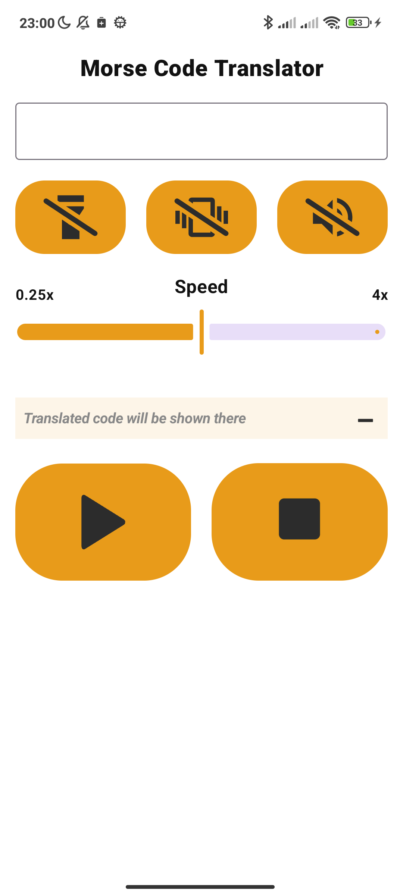
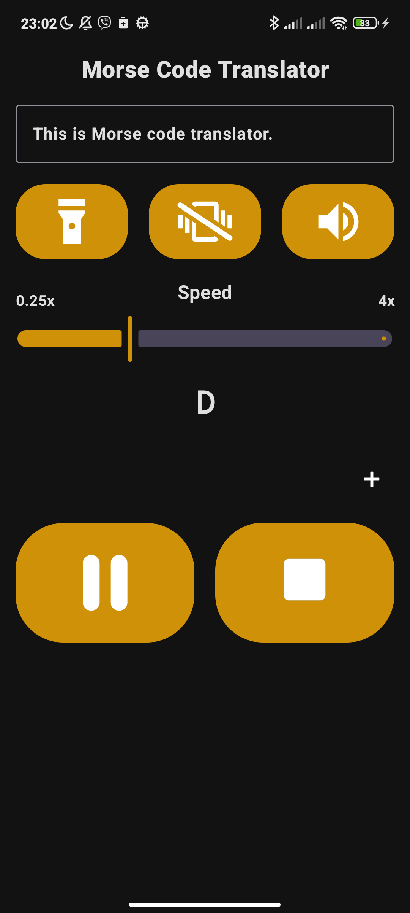
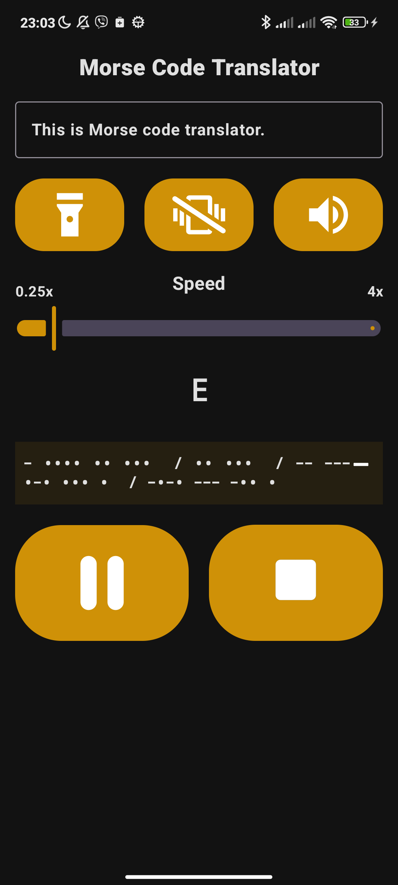
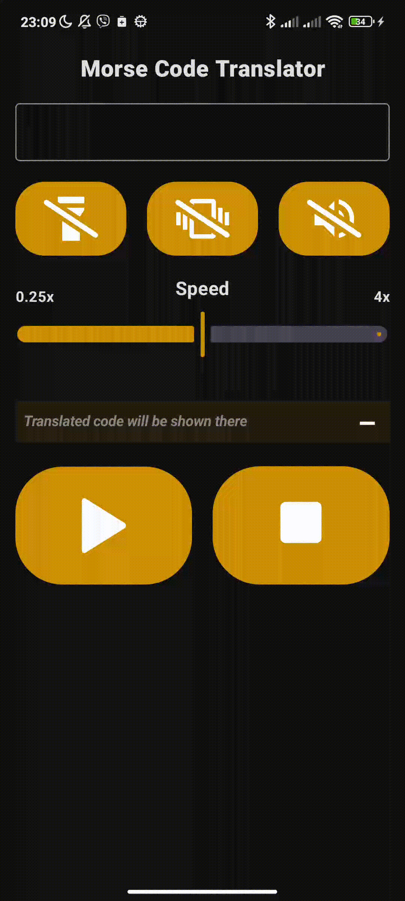

# Morse Code Translator App

A sleek and modern **Morse code translator** built with **Jetpack Compose**. Instantly convert typed text into Morse code, and play it using **sound**, **vibration**, or **flashlight pulses**.

---

## Features 📡

- 🔤 **Translate text** to Morse code in real-time  
- 🔊 **Play Morse code** using:
  - Sound (beeps)
  - Vibration (haptic)
  - Flashlight (LED blinking)
- 🎚 **Adjust playback speed** (from 0.25x to 4x)
- 🔍 **Live view** of current letter and full Morse output
- 🔘 **Minimize/expand translation display** with animation
- 🎮 **Intuitive control panel** with animated play/pause/stop buttons
- 💡 Fully supports **dark mode** and **light mode**

---

## Screenshots 📱

| Light Mode | Dark Mode | Dark Mode |
| ----------- | ------------- | -------------- |
|  |  |  |

---

## Demo 🎥

---

## Tech Stack 🛠️

- **Kotlin**
- **Jetpack Compose**
- **Material 3**
- **Coroutines** – for timed playback
- **Lottie Animations** – for play/pause/stop and minimize icons
- **Jetpack ViewModel** – for state management
- **Android System APIs** – for flashlight, vibration, and audio output

---

## License 📄

This project is licensed under the **MIT License** – see the [LICENSE](LICENSE) file for details.

---

## Contact 📫

For any inquiries or feedback, feel free to contact me:

- **LinkedIn:** [Marek Storek](https://www.linkedin.com/in/marekstorek1)
- **Email:** marek.storek1@gmail.com
